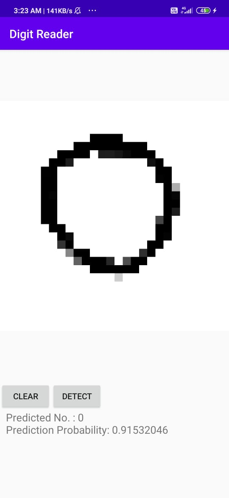
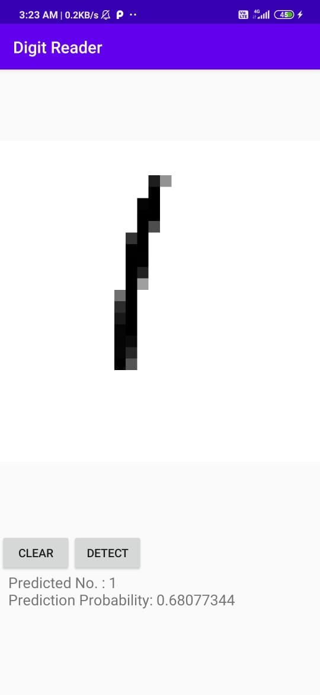
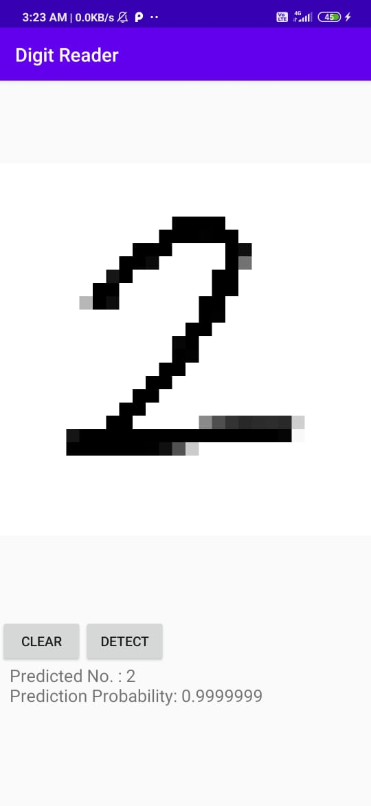
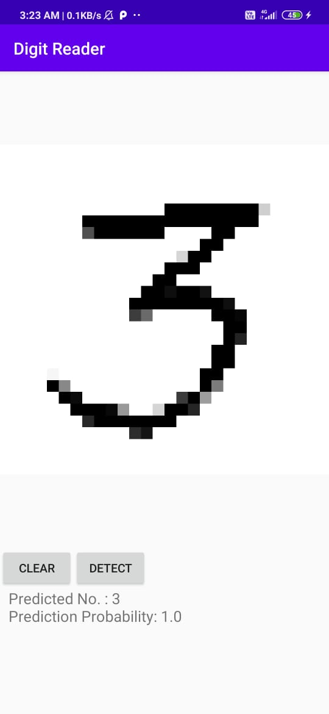
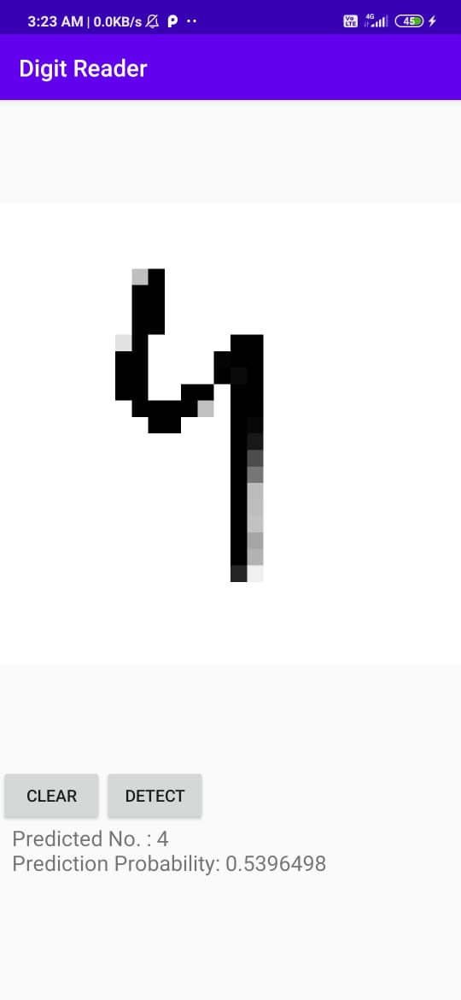
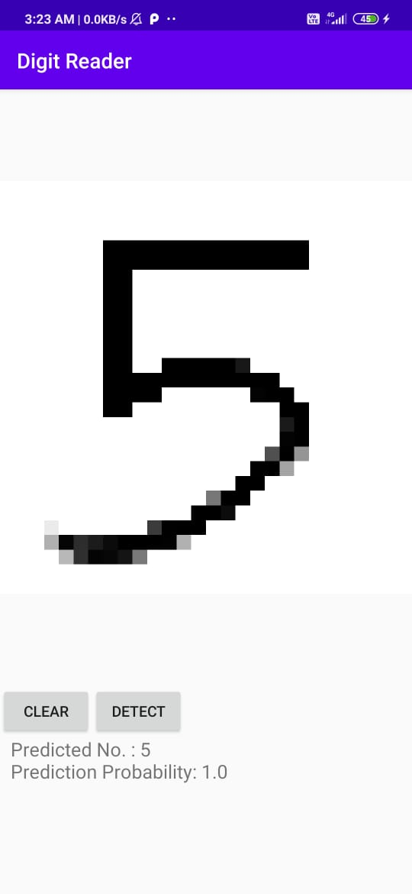
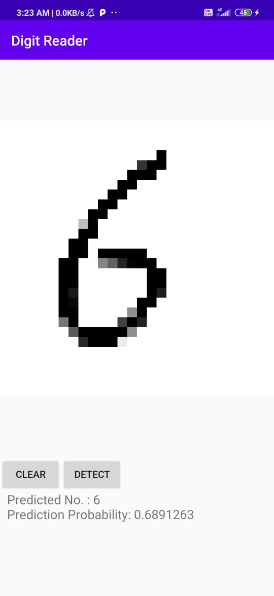
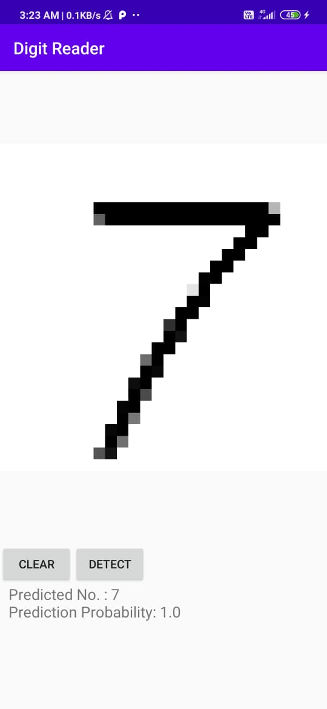

# Handwritten Digit Recoginition using CNN
 Built and trained CNN model on MNIST dataset and implemented it inside android application. User can simply draw a digit on mobile screen and model will detect the number.
 
  
 
 ## Screenshots of application - 
 

|                                          |                                          |                                         |     |
|------------------------------------------|------------------------------------------|-----------------------------------------|-----|
  |  | |  |
 
 
 |                                          |                                          |                                         |     |
|------------------------------------------|------------------------------------------|-----------------------------------------|-----|
  |  | |  |
 
